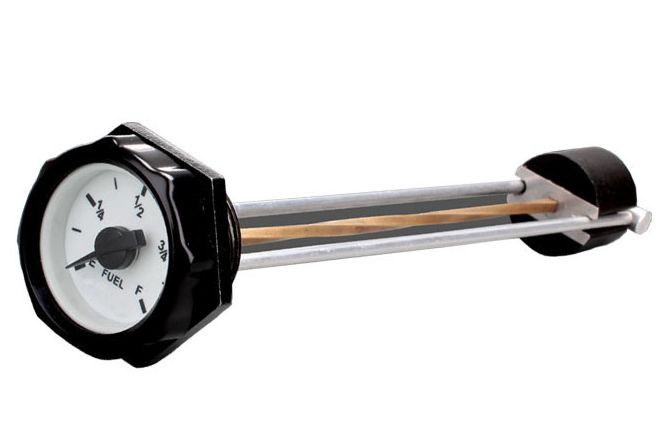

---
title:
 - Water Level Sensor Presentation
subtitle:
 - Version &hash
author:
 - Joe
 - James
 - Aiden
 - Alex
institute:
 - SNHU/CETA, EG-110
titlegraphic: ../../resources/TeamLogo.png
theme: Berlin
navigation: frame
date: "Build Date: &date"
aspectratio: 1610
logo: resources/TeamLogo.png
fontsize: 8pt
section-titles: false
thanks: Alex was there at at least 2 meetings
---

# Introduction

## Presentation Overview

Thank you for attending our presentation, in this
presentation we will cover the research, prototyping,
assembly and final notes for our **Water Level Sensor** project!

### Note

Use the progress bar above to see our presentation progress at any time!

## Problem Statement

Our problem statement is the guide we employed to help us stick to our design goals
and make a product that will actually help.

### Our Problem Statement

*We must create and implement a solution that is **precise**, **functional**, **easy
to use**, **Simple to repair** and will **last a long time**.*

# Concepts

## Concept 1 : Head Pressure Gauge

::: columns

:::: {.column width=50%}

### Construction of Concept

{ height=60% }

::::

:::: {.column width=50%}

### How concept solves problem

 - [x] Functional
 - [x] Serviceable
 - [x] Simple to Operate
 - [x] Simple to implement
 - [x] Cost effective

### Strengths and weaknesses

 - Strengths
   - Cheap and super simple
   - Easy to source parts
   - Easy to install in situ
 - Weaknesses
   - Small and unassuming
   - Requires upfront calibration
   - Introduces failure points below the waterline

::::

:::

## Concept 2 : Hall Effect Sensor

::: columns

:::: {.column width=50%}

### Construction of Concept

{ height=60% }

::::

:::: {.column width=50%}

### How concept solves problem

 - [x] Functional
 - [ ] Serviceable
 - [ ] Simple to Operate
 - [ ] Simple to implement
 - [ ] Cost effective

### Strengths and weaknesses

 - Strengths
   - Super accurate and pretty reliable
   - Safe to put in drinking water
   - Introduces no failure points below the waterline
 - Weaknesses
   - Very expensive
   - Impossible to source locally
   - Very difficult to service in situ
   - Requires electricity

::::

:::

## Concept 3 : Helical Float Gauge

::: columns

:::: {.column width=50%}

### Construction of Concept

{ height=60% }

::::

:::: {.column width=50%}

### How concept solves problem

 - [x] Functional
 - [x] Serviceable
 - [x] Simple to Operate
 - [ ] Simple to implement
 - [x] Cost effective

### Strengths and weaknesses

 - Strengths
   - Cheap and easy to service
   - Parts are simple and accessible
   - Construction is lenient (in situ resources)
   - No failure points below the waterline
   - Very visible
 - Weaknesses
   - Not very accurate
   - Prone to lockup/failure
   - Introduces contamination vector points
   - Requires calibration

::::

:::

## Concept 4 : Transducer Indicator

::: columns

:::: {.column width=50%}

### Construction of Concept

{ height=60% }

::::

:::: {.column width=50%}

### How concept solves problem

 - [x] Functional
 - [ ] Serviceable
 - [ ] Simple to Operate
 - [x] Simple to implement
 - [ ] Cost effective

### Strengths and weaknesses

 - Strengths
   - Accurate up to a dead zone
   - Does not touch or introduce pathogen vectors to the water
   - Simple and no moving parts
 - Weaknesses
   - Requires electricity
   - Difficult to service in situ
   - Expensive and requires software interfacing

::::

:::

# Concept Selection

## Evaluation Matrix

| Prototype   | cost | maintain.[^1] | prod.[^2] | effect.[^3] | acc.[^4] | safety | depend.[^5] | Usability | Tot  |
| ----------- | ---- | ------------- | --------- | ----------- | -------- | ------ | ----------- | --------- | ---- |
| Head Pres.  | 9    | 10            | 10        | 8           | 4        | 9      | 8           | 7         | 65   |
| Sight Glass | 5    | 9             | 7         | 9           | 8        | 9      | 8           | 10        | 65   |
| Helix       | 6    | 9             | 3         | 10          | 6        | 6      | 10          | 9.5       | 59.5 |
| Transducer  | 4    | 9             | 6.5       | 6           | 9        | 10     | 4           | 5         | 53.5 |
| Hall Effect | 1    | 9             | 1         | 6           | 10       | 9      | 2           | 1         | 39   |
| Flow Meter  | 4    | 6             | 6.5       | 6           | 1        | 4      | 4           | 1         | 32.5 |

[^1]: Maintenance (Higher is easier to maintain)
[^2]: Production (Higher is easier to produce)
[^3]: Effectiveness (Higher is more effective)
[^4]: Accuracy (Higher is more accurate)
[^5]: Dependencies (Lower is more dependencies)

## Notes on Concept Selection

We went with the Helix because we felt it that overall it would be more
beneficial for the water level sensor to be more visible and the helical
gauge allows for this, its also much easier to repair with in situ parts.

If we were to redraw the concept eval matrix with different weights, using
higher weights for these catagories could be beneficial.

# Final Prototype

## Photos

::: columns

:::: {.column width=50%}

{ height=60% }

### Final Assembled Prototype

The final assembled prototype is a little bit rough around the edges but
even at a smaller scale seems to work fine!

::::

:::: {.column width=50%}

{ height=60% }

### Final CAD

The cad matches the final prototype very well, this is a nice success!

::::

:::

## How it works

{ height=60% }

### Theory of Operation

At its core, the helical float gauge uses a captive helical plate
cut into the float to provide a gentle twist as it rises in water level,
this is analogous to a worm screw but in reverse.

# Lessons Learned

## Teamwork

This time around, the team was more of a team and less of a 
group of students. Work was distributed better, and even
more communication occurred in and out of class.

### Editors Note

I think we made an improvement over the last workload distribution!

## Communications

{ height=60% }

### Discord

Like before, we communicated over discord, witch did help a lot since
we were not often all present together in class. Using a tool 
like discord or slack can really help asynchronous teams to pull together.

## Interpersonal

As a team A-B talked and interacted more, witch spurred on more
communication and better group work.

# Misc/Extra

## Git

### Git

This whole project, like the previous project were all managed via git! You can check us out here: https://github.com/KenwoodFox/EG-110-water_level

### Github

{ height=60% }

## Full size prototype

{ height=60% }

### Full size prototype

We also spent some time to make design a 'full size' prototype.

The full size prototype would need 2 dials, with 6 rotations per full traversal of the tank.

## How was this all made?

### Source

See our source CAD, designs, sources all here!

{ height=30% }

### Tools used

 - FreeCAD
 - Pandoc/LaTeX
 - Git
