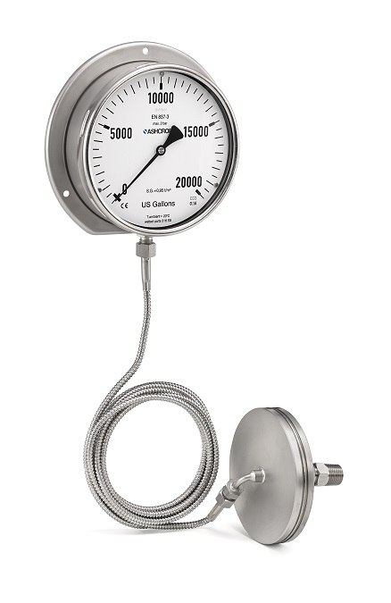

---
title:
 - Engineering Project Presentation
subtitle:
 - Version &hash
author:
 - Joe
 - Aiden
 - James
 - Aiden
institute:
 - SNHU/CETA, EG-110
titlegraphic: ../../resources/TeamLogo.png
theme: Berlin
navigation: frame
date: "Build Date: &date"
aspectratio: 1610
logo: resources/TeamLogo.png
fontsize: 8pt
section-titles: false
---

# Introduction

## Presentation Overview

Thank you for attending our presentation, in this
presentation we will cover the research, prototyping,
assembly and final notes for our **Water Level Sensor** project!

### Note

Use the progress bar above to see our presentation progress at any time!

## Problem Statement

 $problemStatement

# Concepts

## Concept 1 : Head Pressure Gauge

::: columns

:::: {.column width=50%}

### Construction of Concept

{ height=60% }

::::

:::: {.column width=50%}

### How concept solves problem

 - [x] Functional
 - [x] Serviceable
 - [x] Simple to Operate
 - [x] Simple to implement
 - [x] Cost effective

### Strengths and weaknesses

 - Strengths
   - Cheap and super simple
   - Easy to source parts
   - Easy to install in situ
 - Weaknesses
   - Small and unassuming
   - Requires upfront calibration
   - Introduces failure points below the waterline

::::

:::

## Concept 2 : Hall Effect Sensor

::: columns

:::: {.column width=50%}

### Construction of Concept

{ height=60% }

::::

:::: {.column width=50%}

### How concept solves problem

 - [x] Functional
 - [ ] Serviceable
 - [ ] Simple to Operate
 - [ ] Simple to implement
 - [ ] Cost effective

### Strengths and weaknesses

 - Strengths
   - Super accurate and pretty reliable
   - Safe to put in drinking water
   - Introduces no failure points below the waterline
 - Weaknesses
   - Very expensive
   - Impossible to source locally
   - Very difficult to service in situ
   - Requires electricity

::::

:::

## Concept 3 : Helical Float Gauge

::: columns

:::: {.column width=50%}

### Construction of Concept

{ height=60% }

::::

:::: {.column width=50%}

### How concept solves problem

 - [x] Functional
 - [x] Serviceable
 - [x] Simple to Operate
 - [ ] Simple to implement
 - [x] Cost effective

### Strengths and weaknesses

 - Strengths
   - Cheap and easy to service
   - Parts are simple and accessible
   - Construction is lenient (in situ resources)
   - No failure points below the waterline
   - Very visible
 - Weaknesses
   - Not very accurate
   - Prone to lockup/failure
   - Introduces contamination vector points
   - Requires calibration

::::

:::

## Concept 4 : Transducer Indicator

::: columns

:::: {.column width=50%}

### Construction of Concept

{ height=60% }

::::

:::: {.column width=50%}

### How concept solves problem

 - [x] Functional
 - [ ] Serviceable
 - [ ] Simple to Operate
 - [x] Simple to implement
 - [ ] Cost effective

### Strengths and weaknesses

 - Strengths
   - Accurate up to a dead zone
   - Does not touch or introduce pathogen vectors to the water
   - Simple and no moving parts
 - Weaknesses
   - Requires electricity
   - Difficult to service in situ
   - Expensive and requires software interfacing

::::

:::

# Concept Selection

## Evaluation Matrix

| Prototype   | cost | maintain.[^1] | prod.[^2] | effect.[^3] | acc.[^4] | safety | depend.[^5] | Usability | Tot  |
| ----------- | ---- | ------------- | --------- | ----------- | -------- | ------ | ----------- | --------- | ---- |
| Head Pres.  | 9    | 10            | 10        | 8           | 4        | 9      | 8           | 7         | 65   |
| Sight Glass | 5    | 9             | 7         | 9           | 8        | 9      | 8           | 10        | 65   |
| Helix       | 6    | 9             | 3         | 10          | 6        | 6      | 10          | 9.5       | 59.5 |
| Transducer  | 4    | 9             | 6.5       | 6           | 9        | 10     | 4           | 5         | 53.5 |
| Hall Effect | 1    | 9             | 1         | 6           | 10       | 9      | 2           | 1         | 39   |
| Flow Meter  | 4    | 6             | 6.5       | 6           | 1        | 4      | 4           | 1         | 32.5 |

[^1]: Maintenance (Higher is easier to maintain)
[^2]: Production (Higher is easier to produce)
[^3]: Effectiveness (Higher is more effective)
[^4]: Accuracy (Higher is more accurate)
[^5]: Dependencies (Lower is more dependencies)

# Final Prototype

## Photos

## How it works

And also how unique it is

# Lessons Learned

## Interpersonal

## Teamwork

## Communications

# Misc/Extra

## How was this slideshow made?
